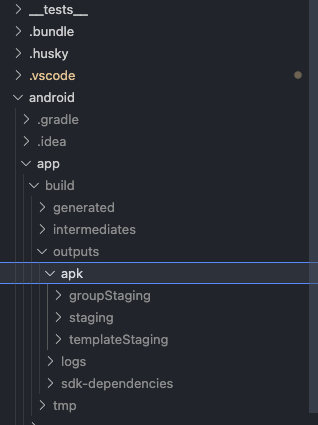
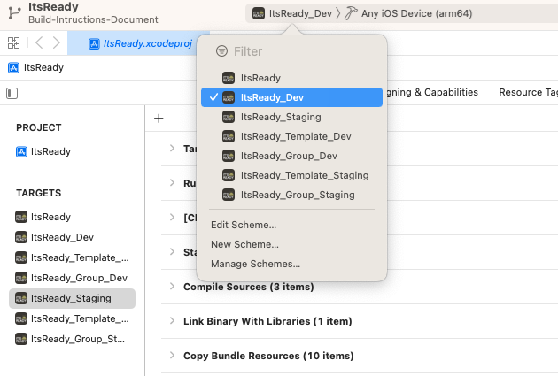
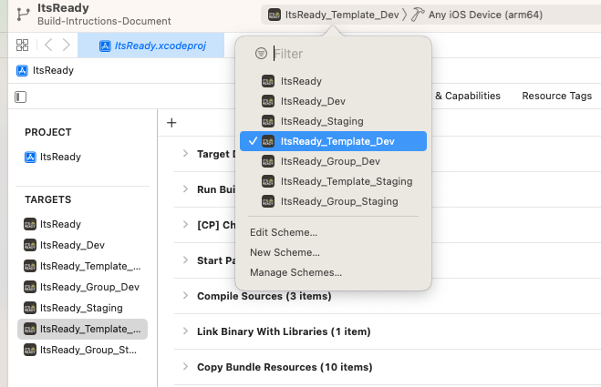
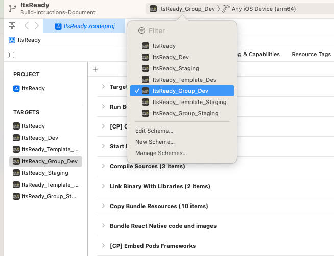

#

## Build Instructions for DEV and STAGING Environments

### Setup React Native Development Environment

```bash
https://reactnative.dev/docs/environment-setup
```

### Get Latest Source Code

Clone latest source code:

```bash
git clone git@gitlab.com:vitex.asia/it-ready-react-native.git
```

then

```bash
git checkout develop
```

### Install Project's Dependencies

1. Open terminal at root project folder
2. Run

```bash
yarn && cd ios && pod install && cd ..
```

---

### Build Android Apps

#### Increase Android App's Build Number

1. Open terminal at root project folder
2. Run

```bash
./bump_build_number.sh
```

3. Select `1`

The script will increase `android versionCode` by 1.

#### Build Android General App

```bash
yarn android:dev:release:apk
```

Or for `staging` environment:

```bash
yarn android:stag:release:apk
```

#### Build Android Template App

```bash
yarn android:template_dev:release:apk
```

Or for `staging` environment:

```bash
yarn android:template_stag:release:apk
```

#### Build Android Group App

```bash
yarn android:group_dev:release:apk
```

Or for `staging` environment:

```bash
yarn android:group_stag:release:apk
```

#### Android Build Output Files

After the build process is successful, the .apk files will be located at `android/app/build/outputs/apk`. You can use the .apk files to upload to Firebase App Distribution, so you can test the apps via Firebase App Tester.



---

### Build IOS Apps

#### Increase IOS App's Build Number

1. Open terminal at root project folder
2. Run

```bash
./bump_build_number.sh
```

3. Select `2`

The script will increase  `ios CFBundleVersion` by 1.

#### Build IOS General App

1. Open `ios/ItsReady.xcworkspace` in Xcode
2. Select `ItsReady_Dev` build target or `ItsReady_Staging` if you want to build for `staging` environment
   
3. From Xcode menu, select `product > Archive` to build ios bundle file
4. After archive process is successful, follow the Xcode steps to upload the ios bundle to Testflight

#### Build IOS Template App

1. Open `ios/ItsReady.xcworkspace` in Xcode
2. Select `ItsReady_Template_Dev` build target or `ItsReady_Template_Staging` if you want to build for `staging` environment
   
3. From Xcode menu, select `product > Archive` to build ios bundle file
4. After archive process is successful, follow the Xcode steps to upload the ios bundle to Testflight

#### Build IOS Group App

1. Open `ios/ItsReady.xcworkspace` in Xcode
2. Select `ItsReady_Group_Dev` build target or `ItsReady_Group_Staging` if you want to build for `staging` environment
   
3. From Xcode menu, select `product > Archive` to build ios bundle file
4. After archive process is successful, follow the Xcode steps to upload the ios bundle to Testflight
