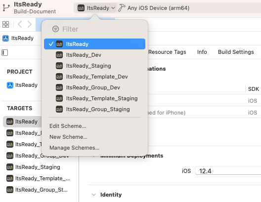

#

## Build Instructions for PRODUCTION Environments

### Setup React Native Development Environment

```bash
https://reactnative.dev/docs/environment-setup
```

### Get Latest Source Code

Clone latest source code:

```bash
git clone git@gitlab.com:vitex.asia/it-ready-react-native.git
```

then

```bash
git checkout develop
```

### Install Project's Dependencies

1. Open terminal at root project folder
2. Run

```bash
yarn && cd ios && pod install && cd ..
```

---

### Build Android Apps

#### Build Android General App

1. Open `.env.prod` file
2. Increase `ENV_ANDROID_VERSION_CODE` variable value by 1
3. Increase `ENV_ANDROID_VERSION_NAME` variable, ex: `1.1.2` => `1.1.3`
4. Run

```bash
yarn android:prod:aab
```

After the build process is successful, a file named `app-prod-release.aab` will be created in `android/app/build/outputs/bundle/prodRelease` folder.
You can use this file to upload to GooglePlay Store to create an app release.

#### Build Android Template App

> If your app template has not been setup before, you may not see the corresponding .env file, please [setup your app](./setup_new_app.md) first.

1. Open the `.env.template.your-app-name` file corresponding to your app template, ex: `.env.template.readyfreddy`
2. Increase `ENV_ANDROID_VERSION_CODE` variable value by 1
3. Increase `ENV_ANDROID_VERSION_NAME` variable, ex: `1.1.2` => `1.1.3`
4. Run

```bash
cp .env.template.your-app-name .env && rm -rf android/app/build && cd android && ./gradlew bundleYourAppNameRelease && cd ..
```

> Replace `.env.template.your-app-name` with the .env file corresponding to your app and Replace `bundleYourAppNameRelease` with your app `productFlavors` created in [Setup new app](./setup_new_app.md). Ex: `bundleReadyFreddyRelease`

After the build process is successful, a file named `app-yourappname-release.aab` will be created in `android/app/build/outputs/bundle/yourappnameRelease` folder.
You can use this file to upload to GooglePlay Store to create an app release.

#### Build Android Group App

> If your app group has not been setup before, you may not see the corresponding .env file, please [setup your app](./setup_new_app.md) first.

1. Open the `.env.group.your-app-name` file corresponding to your app template, ex: `.env.group.readyfreddy`
2. Increase `ENV_ANDROID_VERSION_CODE` variable value by 1
3. Increase `ENV_ANDROID_VERSION_NAME` variable, ex: `1.1.2` => `1.1.3`
4. Run

```bash
cp .env.group.your-app-name .env && rm -rf android/app/build && cd android && ./gradlew bundleYourAppNameRelease && cd ..
```

> Replace `.env.group.your-app-name` with the .env file corresponding to your app and Replace `bundleYourAppNameRelease` with your app `productFlavors` created in [Setup new app](./setup_new_app.md). Ex: `bundleReadyFreddyRelease`

After the build process is successful, a file named `app-yourappname-release.aab` will be created in `android/app/build/outputs/bundle/yourappnameRelease` folder.
You can use this file to upload to GooglePlay Store to create an app release.

---

### Build IOS Apps

#### Build IOS General App

1. Open `.env.prod` file
2. Increase `ENV_IOS_VERSION_CODE` variable value by 1
3. Increase `ENV_IOS_VERSION_NAME` variable, ex: `1.1.2` => `1.1.3`
4. Open `ios/ItsReady.xcworkspace` in Xcode
5. Select `ItsReady` build target
   
6. From Xcode menu, select `product > Archive` to build ios archive file
7. After archive process is successful, follow the Xcode steps to upload the ios archive to Testflight

#### Build IOS Template App

> If your app template has not been setup before, you may not see the corresponding .env file, please [setup your app](./setup_new_app.md) first.

1. Open the `.env.template.your-app-name` file corresponding to your app template, ex: `.env.template.readyfreddy`
2. Increase `ENV_IOS_VERSION_CODE` variable value by 1
3. Increase `ENV_IOS_VERSION_NAME` variable, ex: `1.1.2` => `1.1.3`
4. Open `ios/ItsReady.xcworkspace` in Xcode
5. Select `ItsReady_Template_YouAppName` build target (created in [Setup new app](./setup_new_app.md). Ex: `ItsReady_Template_ReadyFreddy`)
6. From Xcode menu, select `product > Archive` to build ios archive file
7. After archive process is successful, follow the Xcode steps to upload the ios archive to Testflight

#### Build IOS Group App

> If your app group has not been setup before, you may not see the corresponding .env file, please [setup your app](./setup_new_app.md) first.

1. Open the `.env.group.your-app-name` file corresponding to your app group, ex: `.env.group.readyfreddy`
2. Increase `ENV_IOS_VERSION_CODE` variable value by 1
3. Increase `ENV_IOS_VERSION_NAME` variable, ex: `1.1.2` => `1.1.3`
4. Open `ios/ItsReady.xcworkspace` in Xcode
5. Select `ItsReady_Group_YouAppName` build target (created in [Setup new app](./setup_new_app.md). Ex: `ItsReady_Group_ReadyFreddy`)
6. From Xcode menu, select `product > Archive` to build ios archive file
7. After archive process is successful, follow the Xcode steps to upload the ios archive to Testflight
